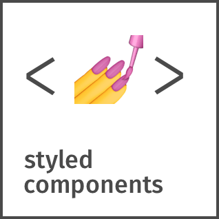
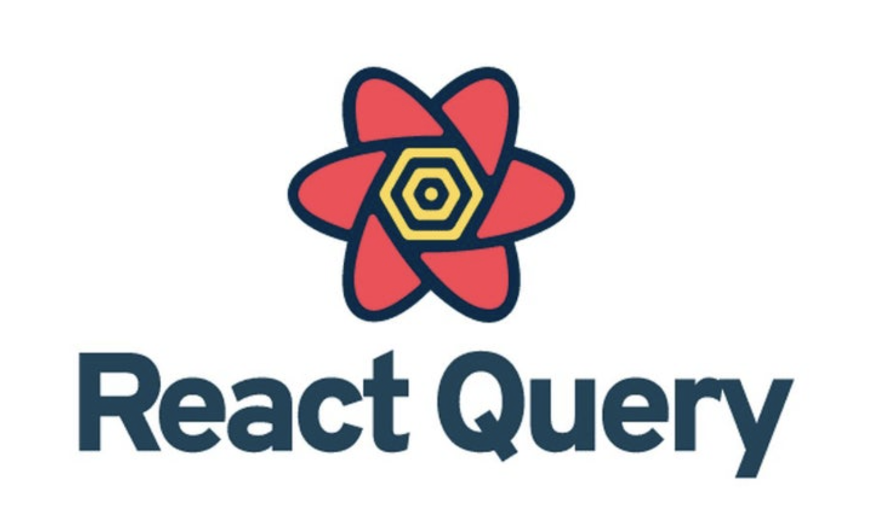
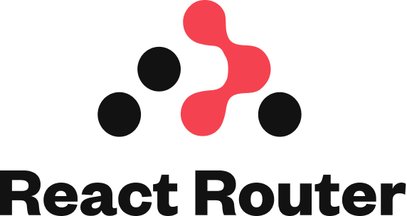
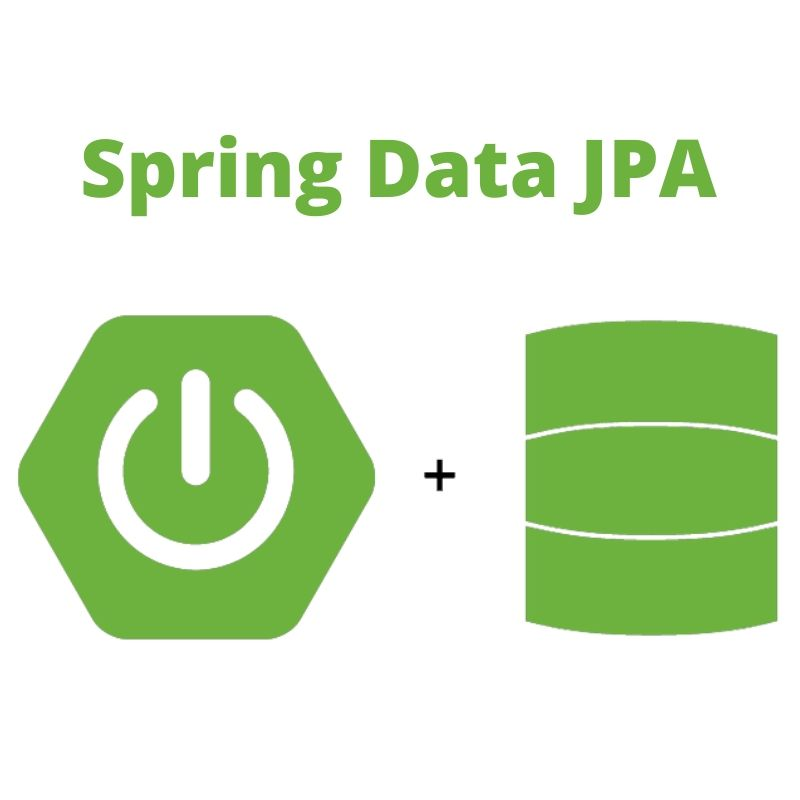
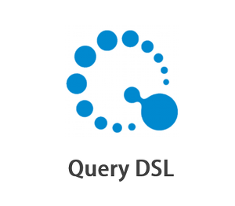
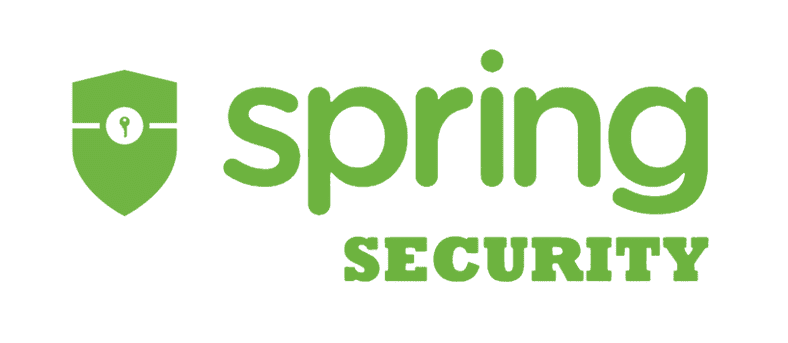
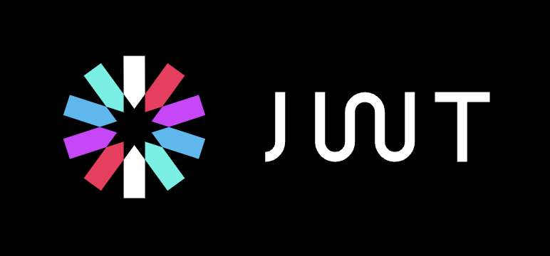

# 포팅 매뉴얼

# I. 개요

## I - 1. 프로젝트 개요

실시간 화상 통화를 활용하여 정확한 상품 확인이 가능한 서비스

허위 매물 방지 효과 및 판매 당시 상품 상태 기록을 통해, 사용자 구매자 양측의 사기 방지 서비스 제공

<br/><br/>

## I - 2. 프로젝트 사용 도구

이슈 관리 : JIRA

형상 관리 : GitLab

커뮤니케이션 : Notion, Mattermost, Slack

디자인 : Figma

UCC : 모바비

CI / CD : Jenkins

<br/><br/><br/>

## I - 3. 개발 환경

### 1-3-1. JVM, 웹서버, WAS 종류 및 설정값, 버전

- JVM
  - openJDK 1.8.0_312(Zulu 8)
- 웹서버
  - NGINX(nginx/1.25.1(Ubuntu))
- WAS 제품 종료 및 설정값
  - SpringBoot 내장 톰캣 : spring-boot-starter-tomcat-2.7.13.jar
- 버전(IDE 버전)
  - Gradle : 7.6.1
  - IntelliJ IDEA : Ultimate, 2021.3
  - Visual Studio Code : 1.81.1

<br/><br/>

### I-3-2. Front-End

  
 

1. React 18.2.0
2. TypeScript 4.4.2
3. React-Query 4.32.0
4. Styled-Components 6.0.7
5. React-Router-Dom 5.3.3
6. openvidu-browser 2.28.0
7. React-Hook-Form 7.45.2

<br/><br/>

### I-3-3. Back-End

 
 

1. openJDK 1.8.0_312(Zulu 8)
2. Spring Boot 2.7.13
3. Spring Data Jpa 2.7.13
4. Spring-Security 2.7.1
5. Jwt 0.11.2
6. QueryDSL 1.0.10

<br/><br/><br/>

## I - 4. 외부 서비스

### I-4-1. Amazon S3

### I-4-2. OpenVidu

<br/><br/><br/>

# II. 빌드

## II - 1. **빌드 및 배포 문서**

### II-1-1. 빌드 시 사용되는 환경 변수

```
✔️ application.yml 참조
```

<br/><br/>

### II-1-2. 배포 시 특이사항

```
✔️ FrontEnd 배포 시 -> NGINX
✔️ BackEnd 배포 시 -> Spring Boot 내장 톰캣
```

<br/><br/>

### II-1-3. 데이터베이스 접속 정보

```markdown
✔️ **application.yml**

java
datasource:
driver-class-name: com.mysql.cj.jdbc.Driver
hikari:
password: zucchini
username: zucchini
url: jdbc:mysql://i9a209.p.ssafy.io:3308/zucchini?useUnicode=true&characterEncoding=utf8&serverTimezone=Asia/Seoul&zeroDateTimeBehavior=convertToNull&rewriteBatchedStatements=true
redis:
host: i9a209.p.ssafy.io
port: 6379
```

<br/><br/>

### II-1-4. 배포 순서

- docker 설치(최신 버전)
- docker-compose 설치(1.25.0 버전으로 설치)
- openvidu 먼저 설치(포트 겹치는 상황 방지용)
- 참고 매뉴얼 : [https://docs.openvidu.io/en/2.28.0/deployment/ce/on-premises/](https://docs.openvidu.io/en/2.28.0/deployment/ce/on-premises/)
- openvidu 설치 명령어 실행

```java
curl https://s3-eu-west-1.amazonaws.com/aws.openvidu.io/install_openvidu_latest.sh | bash
```

- cd /opt/openvidu 명령어 실행 후 `sudo vim .env` 명령어 실행
- .env

```java
# OpenVidu configuration
# ----------------------
# Documentation: https://docs.openvidu.io/en/stable/reference-docs/openvidu-config/

# NOTE: This file doesn't need to quote assignment values, like most shells do.
# All values are stored as-is, even if they contain spaces, so don't quote them.

# Domain name. If you do not have one, the public IP of the machine.
# For example: 198.51.100.1, or openvidu.example.com
DOMAIN_OR_PUBLIC_IP=i9a209.p.ssafy.io

# OpenVidu SECRET used for apps to connect to OpenVidu server and users to access to OpenVidu Dashboard
OPENVIDU_SECRET=pikapikapikachu

# Certificate type:
# - selfsigned:  Self signed certificate. Not recommended for production use.
#                Users will see an ERROR when connected to web page.
# - owncert:     Valid certificate purchased in a Internet services company.
#                Please put the certificates files inside folder ./owncert
#                with names certificate.key and certificate.cert
# - letsencrypt: Generate a new certificate using letsencrypt. Please set the
#                required contact email for Let's Encrypt in LETSENCRYPT_EMAIL
#                variable.
CERTIFICATE_TYPE=letsencrypt

# If CERTIFICATE_TYPE=letsencrypt, you need to configure a valid email for notifications
LETSENCRYPT_EMAIL=zucchini0209@gmail.com

# Proxy configuration
# If you want to change the ports on which openvidu listens, uncomment the following lines

# Allows any request to http://DOMAIN_OR_PUBLIC_IP:HTTP_PORT/ to be automatically
# redirected to https://DOMAIN_OR_PUBLIC_IP:HTTPS_PORT/.
# WARNING: the default port 80 cannot be changed during the first boot
# if you have chosen to deploy with the option CERTIFICATE_TYPE=letsencrypt
HTTP_PORT=8442

# Changes the port of all services exposed by OpenVidu.
# SDKs, REST clients and browsers will have to connect to this port
HTTPS_PORT=8443

# Old paths are considered now deprecated, but still supported by default.
# OpenVidu Server will log a WARN message every time a deprecated path is called, indicating
# the new path that should be used instead. You can set property SUPPORT_DEPRECATED_API=false
# to stop allowing the use of old paths.
# Default value is true
# SUPPORT_DEPRECATED_API=false

# If true request to with www will be redirected to non-www requests
# Default value is false
# REDIRECT_WWW=false

# How many workers to configure in nginx proxy.
# The more workers, the more requests will be handled
# Default value is 10240
# WORKER_CONNECTIONS=10240

# Access restrictions
# In this section you will be able to restrict the IPs from which you can access to
# Openvidu API and the Administration Panel
# WARNING! If you touch this configuration you can lose access to the platform from some IPs.
# Use it carefully.

# This section limits access to the /dashboard (OpenVidu CE) and /inspector (OpenVidu Pro) pages.
# The form for a single IP or an IP range is:
# ALLOWED_ACCESS_TO_DASHBOARD=198.51.100.1 and ALLOWED_ACCESS_TO_DASHBOARD=198.51.100.0/24
# To limit multiple IPs or IP ranges, separate by commas like this:
# ALLOWED_ACCESS_TO_DASHBOARD=198.51.100.1, 198.51.100.0/24
# ALLOWED_ACCESS_TO_DASHBOARD=

# This section limits access to the Openvidu REST API.
# The form for a single IP or an IP range is:
# ALLOWED_ACCESS_TO_RESTAPI=198.51.100.1 and ALLOWED_ACCESS_TO_RESTAPI=198.51.100.0/24
# To limit multiple IPs or or IP ranges, separate by commas like this:
# ALLOWED_ACCESS_TO_RESTAPI=198.51.100.1, 198.51.100.0/24
# ALLOWED_ACCESS_TO_RESTAPI=

# Whether to enable recording module or not
OPENVIDU_RECORDING=true

# Use recording module with debug mode.
OPENVIDU_RECORDING_DEBUG=false

# Openvidu Folder Record used for save the openvidu recording videos. Change it
# with the folder you want to use from your host.
OPENVIDU_RECORDING_PATH=/opt/openvidu/recordings

# System path where OpenVidu Server should look for custom recording layouts
OPENVIDU_RECORDING_CUSTOM_LAYOUT=/opt/openvidu/custom-layout

# if true any client can connect to
# https://OPENVIDU_SERVER_IP:OPENVIDU_PORT/recordings/any_session_file.mp4
# and access any recorded video file. If false this path will be secured with
# OPENVIDU_SECRET param just as OpenVidu Server dashboard at
# https://OPENVIDU_SERVER_IP:OPENVIDU_PORT
# Values: true | false
OPENVIDU_RECORDING_PUBLIC_ACCESS=true

# Which users should receive the recording events in the client side
# (recordingStarted, recordingStopped). Can be all (every user connected to
# the session), publisher_moderator (users with role 'PUBLISHER' or
# 'MODERATOR'), moderator (only users with role 'MODERATOR') or none
# (no user will receive these events)
OPENVIDU_RECORDING_NOTIFICATION=publisher_moderator

# Timeout in seconds for recordings to automatically stop (and the session involved to be closed)
# when conditions are met: a session recording is started but no user is publishing to it or a session
# is being recorded and last user disconnects. If a user publishes within the timeout in either case,
# the automatic stop of the recording is cancelled
# 0 means no timeout
OPENVIDU_RECORDING_AUTOSTOP_TIMEOUT=120

# Maximum video bandwidth sent from clients to OpenVidu Server, in kbps.
# 0 means unconstrained
OPENVIDU_STREAMS_VIDEO_MAX_RECV_BANDWIDTH=1000

# Minimum video bandwidth sent from clients to OpenVidu Server, in kbps.
# 0 means unconstrained
OPENVIDU_STREAMS_VIDEO_MIN_RECV_BANDWIDTH=300

# Maximum video bandwidth sent from OpenVidu Server to clients, in kbps.
# 0 means unconstrained
OPENVIDU_STREAMS_VIDEO_MAX_SEND_BANDWIDTH=1000

# Minimum video bandwidth sent from OpenVidu Server to clients, in kbps.
# 0 means unconstrained
OPENVIDU_STREAMS_VIDEO_MIN_SEND_BANDWIDTH=300

# All sessions of OpenVidu will try to force this codec. If OPENVIDU_STREAMS_ALLOW_TRANSCODING=true
# when a codec can not be forced, transcoding will be allowed
# Values: MEDIA_SERVER_PREFERRED, NONE, VP8, VP9, H264
# Default value is MEDIA_SERVER_PREFERRED
# OPENVIDU_STREAMS_FORCED_VIDEO_CODEC=MEDIA_SERVER_PREFERRED

# Allow transcoding if codec specified in OPENVIDU_STREAMS_FORCED_VIDEO_CODEC can not be applied
# Values: true | false
# Default value is false
# OPENVIDU_STREAMS_ALLOW_TRANSCODING=false

# true to enable OpenVidu Webhook service. false' otherwise
# Values: true | false
OPENVIDU_WEBHOOK=false

# HTTP endpoint where OpenVidu Server will send Webhook HTTP POST messages
# Must be a valid URL: http(s)://ENDPOINT
#OPENVIDU_WEBHOOK_ENDPOINT=

# List of headers that OpenVidu Webhook service will attach to HTTP POST messages
#OPENVIDU_WEBHOOK_HEADERS=

# List of events that will be sent by OpenVidu Webhook service
# Default value is all available events
OPENVIDU_WEBHOOK_EVENTS=[sessionCreated,sessionDestroyed,participantJoined,participantLeft,webrtcConnectionCreated,webrtcConnectionDestroyed,recordingStatusChanged,filterEventDispatched,mediaNodeStatusChanged,nodeCrashed,nodeRecovered,broadcastStarted,broadcastStopped]

# How often the garbage collector of non active sessions runs.
# This helps cleaning up sessions that have been initialized through
# REST API (and maybe tokens have been created for them) but have had no users connected.
# Default to 900s (15 mins). 0 to disable non active sessions garbage collector
OPENVIDU_SESSIONS_GARBAGE_INTERVAL=900

# Minimum time in seconds that a non active session must have been in existence
# for the garbage collector of non active sessions to remove it. Default to 3600s (1 hour).
# If non active sessions garbage collector is disabled
# (property 'OPENVIDU_SESSIONS_GARBAGE_INTERVAL' to 0) this property is ignored
OPENVIDU_SESSIONS_GARBAGE_THRESHOLD=3600

# Call Detail Record enabled
# Whether to enable Call Detail Record or not
# Values: true | false
OPENVIDU_CDR=false

# Path where the cdr log files are hosted
OPENVIDU_CDR_PATH=/opt/openvidu/cdr

# Kurento Media Server image
# --------------------------
# Docker hub kurento media server: https://hub.docker.com/r/kurento/kurento-media-server
# Uncomment the next line and define this variable with KMS image that you want use
# KMS_IMAGE=kurento/kurento-media-server:7.0.1

# Kurento Media Server Level logs
# -------------------------------
# Uncomment the next line and define this variable to change
# the verbosity level of the logs of KMS
# Documentation: https://doc-kurento.readthedocs.io/en/stable/features/logging.html
# KMS_DOCKER_ENV_GST_DEBUG=

# Openvidu Server Level logs
# --------------------------
# Uncomment the next line and define this variable to change
# the verbosity level of the logs of Openvidu Service
# RECOMENDED VALUES: INFO for normal logs DEBUG for more verbose logs
# OV_CE_DEBUG_LEVEL=INFO

# Java Options
# --------------------------
# Uncomment the next line and define this to add
# options to java command
# Documentation: https://docs.oracle.com/cd/E37116_01/install.111210/e23737/configuring_jvm.htm#OUDIG00058
# JAVA_OPTIONS=-Xms2048m -Xmx4096m -Duser.timezone=UTC
```

- /opt/openvidu 폴더 경로에서 `./openvidu start` 명령어 실행
- cd ~ 명령어 실행해서 제일 최상단 폴더로 이동 후 `mkdir jenkins` 명령어 실행
- `cd jenkins`명령어 실행
- `sudo vim docker-compose.yml`(생성 후 아래 내용 기입 후 저장) 명령어 실행
- `docker-compose up -d —build`로 jenkins 컨테이너 실행

```java
jenkins:  # Jenkins Container
		image: jenkins/jenkins:lts
		container_name: jenkins
		volumes:
			- /usr/bin/docker:/usr/bin/docker
			- /var/run/docker.sock:/var/run/docker.sock
			- /var/jenkins_home:/var/jenkins_home
		ports:
			- 8093:8080
		privileged: true
		user: root
		restart: unless-stopped
```

- 젠킨스 세팅 참고 메뉴얼 : https://flame-oval-517.notion.site/CI-CD-29fb5dab25854cda90617651f7aa7eef
- jenkins pipeline

```java
pipeline {
    agent any
    tools {
        gradle "gradle"
        nodejs "node18"
        git "git"
    }

    stages {

        stage('pull') {
            steps {
                 git branch: "master", credentialsId: "Credentials에 등록한 깃랩접근가능한계정 ID", url: 'https://lab.ssafy.com/s09-webmobile1-sub2/S09P12A209'
                 sh  'ls -al'
            }
        }

        stage('front_build') {
            steps {
                    dir('zucchini_frontend'){
                        sh 'ls -al'
                        sh "yarn install"
                        sh "CI=false yarn build"
                }
            }
        }

        stage('back_build') {
            steps {
                dir('zucchini_backend'){
                    sh 'gradle clean build'
                }
            }
        }
    }
}
```

- jenkins에서 프론트와 백 빌드를 진행 후 `cd /var/jenkins_home/workspace/[젠킨스 대시보드 아이템명]` 명령어 실행
- `docker-compose.yml`(gitlab 프로젝트 폴더 최상단에 이미 존재함 새로 생성할 필요 xxx)

```java
version: "3"

services:
  mysql:
    image: mysql:8.0
    container_name: mysql
    ports:
      - 3308:3306 # HOST: CONTAINER
    environment:
      MYSQL_ROOT_PASSWORD: zucchini
    command:
      - --character-set-server=utf8mb4
      - --collation-server=utf8mb4_unicode_ci
    volumes:
      - /var/lib/mysql:/var/lib/mysql

  nginx:
    image: nginx
    container_name: nginx
    build:
      context: ./nginx
      dockerfile: Dockerfile
    ports:
      - "80:80"
      - "443:443"
    volumes:
      - /etc/nginx/conf.d:/etc/nginx/conf.d
      - /etc/letsencrypt:/etc/letsencrypt
    restart: always
    depends_on:
      - frontend
      - backend
    networks:
      - front-connection

  redis:
    image: redis
    command: redis-server /usr/local/conf/redis.conf
    container_name: redis
    ports:
      - 6379:6379
    volumes:
      - ./redis/data:/data
      - ./redis/conf/redis.conf:/usr/local/conf/redis.conf
    labels:
      - "name=redis"
      - "mode=standalone"

  frontend:
    build:
      context: ./zucchini_frontend
      dockerfile: Dockerfile
    container_name: frontend-container
    restart: always
    ports:
      - "3000:3000"
    networks:
      - front-connection

  backend:
    build:
      context: ./zucchini_backend
      dockerfile: Dockerfile
    container_name: backend-container
    restart: always
    ports:
      - "8200:8200"
    networks:
      - front-connection

networks:
  front-connection:
    driver: bridge
```

- cd /var/jenkins_home/workspace/[젠킨스 대시보드 아이템명] 이 폴더에서 `docker-compose up -d —build` 명령어 실행
- `cd /etc/nginx/conf.d` 명령어 실행
- 해당 폴더에서 `sudo vim nginx.conf` 명령어 실행
- nginx.conf

```java
# HTTP 서버 설정
server {
        # 80 포트에서 들어오는 HTTP 요청을 수신
        listen 80;
        # 요청을 처리할 도메인 이름
        server_name i9a209.p.ssafy.io;
        # 서버 버전 정보 숨기기 (보안상의 이유)
        server_tokens off;
        # 모든 HTTP 요청을 HTTPS로 리다이렉트
        location / {
                return 301 https://$server_name$request_uri;
        }
}

# HTTPS 서버 설정
server {
        # 443 포트에서 들어오는 HTTPS 요청을 수신
        listen 443 ssl;
        server_name i9a209.p.ssafy.io;
        server_tokens off;
        # 액세스 로그 기록 비활성화
        access_log off;
        # Let's Encrypt로부터 받은 SSL 인증서와 키 파일 경로
        ssl_certificate /etc/letsencrypt/live/i9a209.p.ssafy.io/fullchain.pem;
        ssl_certificate_key /etc/letsencrypt/live/i9a209.p.ssafy.io/privkey.pem;
#       include /etc/letsencrypt/options-ssl-nginx.conf; # SSL 설정 포함
#       ssl_dhparam /etc/letsencrypt/ssl-dhparams.pem; # DH 파라미터 경로

# 기본 요청을 특정 도메인의 3126 포트로 프록시
        location / {
                proxy_pass http://i9a209.p.ssafy.io:3000;
                proxy_set_header Host $host;
                proxy_set_header X-Forwarded-Host $server_name;
                proxy_set_header X-Real-IP $remote_addr;
                proxy_set_header X-Forwarded-For $proxy_add_x_forwarded_for;
                proxy_set_header X-Forwarded-Proto $scheme;
                proxy_set_header Upgrade $http_upgrade;
                proxy_set_header Connection "upgrade";
                proxy_redirect off;
        }

        location /api/sse/ {
                proxy_pass http://i9a209.p.ssafy.io:8200;
                proxy_set_header Connection '';
                proxy_http_version 1.1;
                proxy_buffering off;
                proxy_cache off;
                proxy_set_header Host $host;
                proxy_set_header X-Forwarded-Host $server_name;
                proxy_set_header X-Real-IP $remote_addr;
                proxy_set_header X-Forwarded-For $proxy_add_x_forwarded_for;
                proxy_set_header X-Forwarded-Proto $scheme;
                proxy_set_header Upgrade $http_upgrade;
                proxy_redirect off;
        }

        # /api/로 시작하는 나머지 요청을 특정 도메인의 8200 포트로 프록시
        location /api/ {
                proxy_pass http://i9a209.p.ssafy.io:8200;
                proxy_set_header Host $host;
                proxy_set_header X-Forwarded-Host $server_name;
                proxy_set_header X-Real-IP $remote_addr;
                proxy_set_header X-Forwarded-For $proxy_add_x_forwarded_for;
                proxy_set_header X-Forwarded-Proto $scheme;
                proxy_set_header Upgrade $http_upgrade;
                proxy_set_header Connection "upgrade";
                proxy_redirect off;
        }
}
```

- `docker restart nginx` 명령어 실행

<br/><br/><br/>

# III. DB 덤프 파일 최신본

[zucchini.sql](%E1%84%91%E1%85%A9%E1%84%90%E1%85%B5%E1%86%BC%20%E1%84%86%E1%85%A2%E1%84%82%E1%85%B2%E1%84%8B%E1%85%A5%E1%86%AF%201d099092edb346f59f4240a858a4faf3/zucchini.sql)
